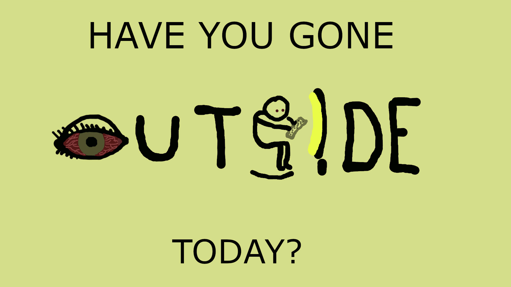

<h1>visual-arg-cdm</h1>
<h2>Visual Argument for ENGCMP0610 (Composing Digital Media)</h2>
<h4>By: Zane Kissel</h4>

<h3>Final Draft, Oct 26</h3>

For my project, I am arguing that people are looking at screens for an unhealthy amount of time. It's easy to be constantly in front of a screen in today's society, where the expectation is that students, teachers, and workers alike will rely on their computers to complete their daily tasks. As brilliant as computers are, it can be unhealthy to extend our use such that we deprive ourselves of physical activity, fresh air, and sunlight. We can't stop using computers, but we can start going outside. 

