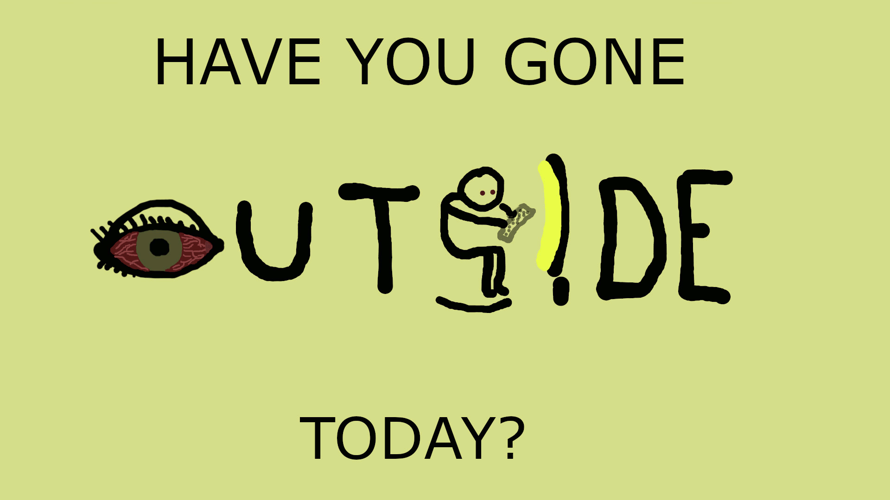

<h2>Visual Argument Reflection - ENGCMP0610</h2>
<h4>By: Zane Kissel</h4>

  The purpose of my project is to persuade the viewer that they're probably sitting in front of electronics too much and not going outside enough. 
  Through the use of carefully selected design decisions, the visual I have created is able to instill a sense of discomfort within the viewer, a sense that they should associate with the overuse of electronics.
  In order to more effectively persuade the viewer, some of my intentional design implementations include point of focus, contrast, and simplicity.

  My project is formatted as a .gif, and thus includes a few focal points throughout. Originally, the focal point consists of the question, "Have you gone outside today?"
  After a few frames the focal point switches to the back of a person's head as they look at their computer screen. With this transfer of focal points,
  the viewer is subtly given an answer to the posed question and simaltaneously prompted to check themselves. Ideally, they see themselves in the person and are persuaded to turn off their device and step outside.

  

  Utilizing contrast in my project was helpful in bolstering my focal point, but also in emphasizing discomfort.
  By contrasting the bright screen with the dark background, I'm able to draw the viewer's attention to the message on the screen. Also, during the second half of the    .gif, the screen still contrasts with the dark background, but is less prominent. This is designed to have the viewer notice the dark, empty space and to associate this loneliness with the lack of nature. 

  

  Lastly, I chose to keep my project simple, which makes it more relatable. Hand-drawing my images gives it a cartoon feel, and satirical cartoons are simple images that still prompt the reader to consider what is being questioned.

